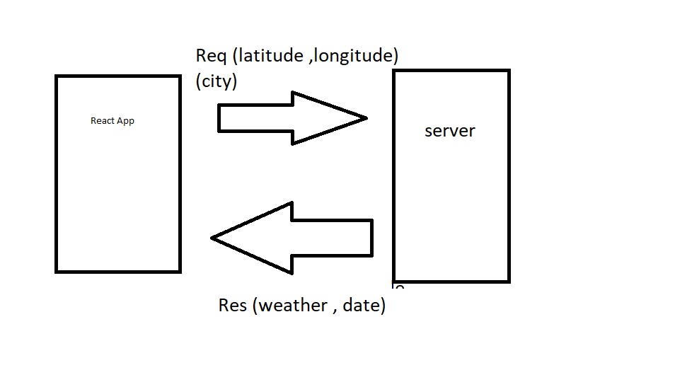

# city-explorer-api 
we are building a search engin that user can search for a location by providing a name of the city that he want, and the application will give the user the latitude and longitude also will give him an snapshot to the map.

Getting Started
planning what we need to do , management the time , start coding.

Architecture
React Component API tool

Change Log
28-08-2022 5:00pm - Application now has a fully-functional express server.

Credit and Collaborations
IsmailAlamir
I really appreciate his collaborations.

Estimate of time needed to complete: 30 min

Start time: 2:00 pm

Finish time: 7:30 pm

 my server in heroku  :  https://server-404.herokuapp.com/
  

 netlify:   https://630df978e7486b46b17607d2--inspiring-dolphin-eb7491.netlify.app/

# request-response cycle
# city-explorer
**Author**: Abdallah mosa
**Version**: v1.0.0
## Overview
we are building a search engin that user can search for a location by providing a name of the city that he want, and the application will give the user the latitude and longitude also will give him an snapshot to the map.
## Getting Started
 planning what we need to do ,
 management the time ,
 start coding.
## Architecture
React Component
API tool
## Change Log
28-08-2022 5:00pm - Application now has a fully-functional express server.
## Credit and Collaborations
[Ismail ](https://github.com/IsmailAlamir)
  I really appreciate his collaborations.
